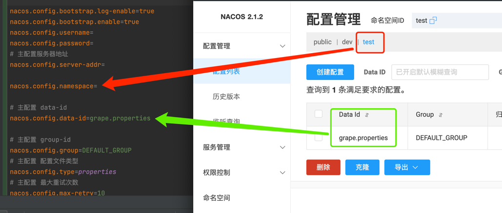

# springboot 使用nacos配置中心

## nacos 官网
### nacos安装包
https://github.com/alibaba/nacos/releases

### nacos-springboot
https://nacos.io/zh-cn/docs/quick-start-spring-boot.html

## 配置映射


## nacos依赖
```xml
        <!-- https://mvnrepository.com/artifact/com.alibaba.boot/nacos-config-spring-boot-starter -->
        <dependency>
            <groupId>com.alibaba.boot</groupId>
            <artifactId>nacos-config-spring-boot-starter</artifactId>
            <version>0.2.12</version>
        </dependency>
```

## 配置拉取测试
### 主启动类
```java
@EnableSwagger2
@MapperScan(basePackages = "com.grapefruit.javaimage.mapper")
@EnableTransactionManagement
@NacosPropertySource(dataId = "${nacos.config.data-id}")
@SpringBootApplication
public class ImgRear {
    public static void main(String[] args)  {
        SpringApplication.run(ImgRear.class, args);
    }
}
```

### 测试类
```java
/*
 *Copyright @2022 Grapefruit. All rights reserved.
 */

package com.grapefruit.javaimage.config;

import com.alibaba.nacos.api.config.annotation.NacosValue;
import org.springframework.stereotype.Service;

import javax.annotation.PostConstruct;

/**
 * nacos配置拉取测试
 *
 * @Author ZhangZhihuang
 * @Date 2022/11/19 07:35
 * @Version 1.0
 */
@Service
public class NacosTest {

    @NacosValue(value = "${name}")
    private String name;

    @PostConstruct
    public void init(){
        System.out.println();
    }
}
```